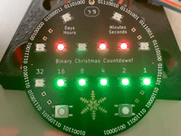
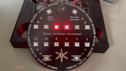

# Christmas Countdown

Christmas Countdown is a Christmas Ornament that counts down to Christmas day (or really any day) in Binary. Using two rows of LEDs, it displays the Days & Hours and then the Minutes & seconds remaining until Christmas Day. If you want to learn about how I approached developing it, and how many times I got it wrong, you can read my writeup of [the whole adventure here](https://aaroneiche.com/2023/02/05/christmas-countdown/) 

The heart of the circuit is an ESP32-C3-Mini-1. It drives fourteen SK6812 LEDs that display the time, as well as an indicator of the current mode. The time is kept by a PCF85363 with a battery backup . The ornament runs off of 5v, and requires about 1A with the LEDs running at full brightness (I do not recommend this, these LEDs will melt your face off) 

### Setting the time.

To set the ornament, press and hold the left button for 3 seconds and release. On the bottom row it shows what you're setting (year, month, day, hour, minute, second) and the top row displays the current value. There are 12 settings in all, 6 for the current date/time, and 6 for the target date/time. You can advance to the next value to set by pressing the left button. You can increase the value by pressing the right button. The value will return to zero (or one) after the maximum value has been reached. You do not need to do any math about timing, just set the current and target dates/times. The default target date is December 25th, 00:00:00 AM. You may wish to set the time to December 25th, 08:00:00 for when you start Christmas with your family. Perhaps you observe Orthodox Christmas and want to set it for January 7th.

When setting the current date/time, the whole bottom row will be lit with the value you're setting flashing on and off.
Here is an example of setting the current year (22 - for 2022)

When setting the target date/time, the whole bottom row will be off with the value you're setting flashing on an off.
Here is an example of setting the target month (12 - for December)

When you've finished setting the values, press and hold the right button for 3 seconds. The countdown values will appear.

## Clock battery

If power is lost to Christmas Countdown, the RTC will go into battery mode automatically and will continue to count time. The RTC battery runs on very low power mode consuming ~320nA. 

If the battery is removed, some settings will be maintained on Christmas Countdown. The current time will need to be set again.

## Adding to the the software

I wrote most of this software in VSCode with PlatformIO. I programmed the Esp32-C3 using a CP1202 USB->UART adapter, and connecting the DTR and RTS pins. Alternatively, you should be able to put the board in download mode by holding down the "Program" button on the back while pressing and releasing the "Reset" button.

Changes to the firmware should be pretty easy to make. It's all (in)conveniently in a single file. A couple of helpful hints: 

A clock interrupt fires 1024 times a second. This is how the clock, and the various display updates are handled. There are currently events that execute at 1s, 0.5s and 0.25s. Any handler can be added to the `quarterSecondOverflow`, `halfSecondOverflow`, and `secondOverflow` branches in the loop. These are good locations for executing frequent.

The very last execution in the loop is to update the display. This creates a buffer and that is fed to the `displayFromBuffer` method. This should make it easy to set the display to whatever you want. To prevent your LEDs from getting overwritten by other stuff, make sure to pay attention to the other modes that are writing to the display. The easiest way to avoid this is to make your own Display Mode - you can add one about line 50 in the `enum DisplayMode`.

# Hardware

I typically order PCBs with 1oz copper, HASL Lead-Free. The Color isn't super important. I think that Black looks best, and if you're willing to splurge, Gold ENIG looks very nice on the Snowflake on the front.

The Piezo buzzer does not currently do anything. I have run some tests where I can get it to play some simple music. It definitely works, I just haven't done anything with it yet.

Taking advantage of the Interact HTML BOM, there's a component placement page included in this repo (`ibom.html`)

## What about Wifi?!?!

Yes, the onboard chip has support for Wifi. Which means that you could set the time automatically using NTP. And you could change settings on a webpage even! I have written some code to support these features, and when they're polished I will be making them available. For now, Christmas countdown must be programmed using a couple of buttons and your cunning.